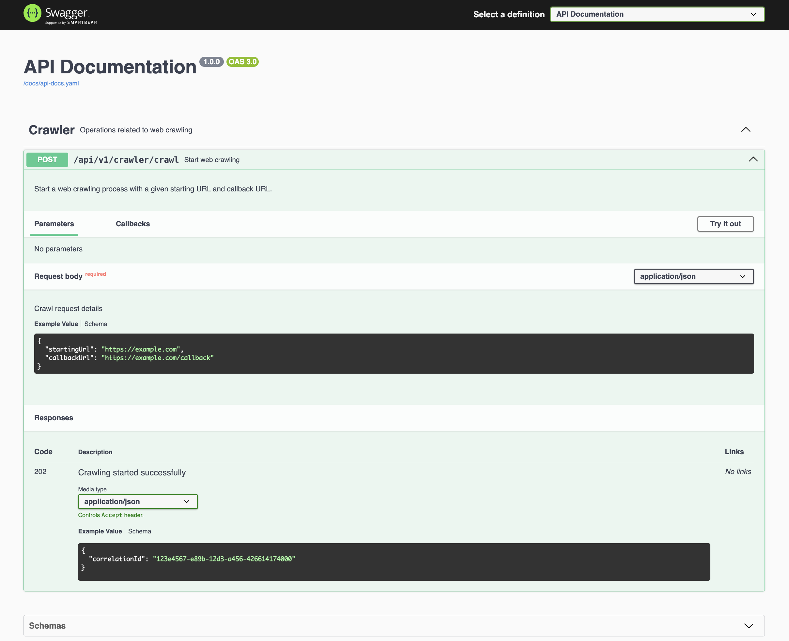
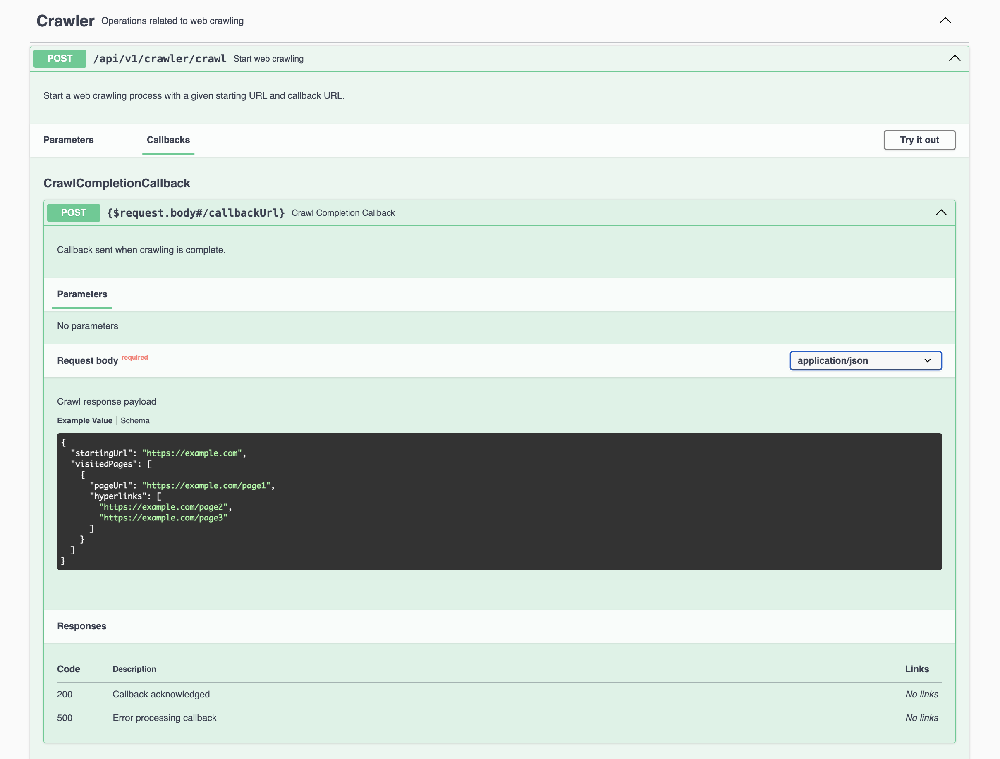

# Web Crawler

## Running The Application

### Prerequisites
- Java 21

### Steps to Run the Application

1. **Build the project:**
   ```sh
   ./mvnw clean install
   ```
2. **Run the application:**
   ```sh
   ./mvnw spring-boot:run
   ```
3. **Access the application:**
- The application will be running at http://localhost:8000.
- Issue a `POST` request to the `/api/v1/crawler/crawl` endpoint to start the web crawling process. 
  ```sh
  curl -X 'POST' \
    'http://localhost:8000/api/v1/crawler/crawl' \
    -H 'accept: application/json' \
    -H 'Content-Type: application/json' \
    -d '{
    "startingUrl": "https://monzo.com/",
    "callbackUrl": "https://webhook.site/ad87fef7-d78b-44c9-bbe0-16ef6773621c"
  }'
   ```
  - Example response body:
    ```json
    {
      "correlationId": "d2fb8430-aaf6-4be4-8932-a89092e9b90d"
    }
    ```
    - Example callback payload (truncated for brevity):
      <details>
        <summary>
          file: <b>crawl_response_d2fb8430-aaf6-4be4-8932-a89092e9b90d.json</b>
        </summary>
        
      ```json
      {
          "startingUrl": "https://monzo.com/",
          "visitedPages": [
            {
                "pageUrl": "https://monzo.com/savings/instant-access",
                "hyperlinks": [
                    "https://monzo.com/savingwithmonzo",
                    "https://monzo.com/legal/browser-support-policy/",
                    "https://monzo.com/legal/mobile-operating-system-support-policy/",
                    "https://monzo.com/pensions",
                    "https://monzo.com/supporting-all-our-customers/",
                    "https://monzo.com/accessibility",
                    "https://monzo.com/investor-information/",
                    "https://monzo.com/fraud/",
                    "https://monzo.com/loans",
                    "https://monzo.com/features/cashback",
                    "https://monzo.com/business-banking",
                    "https://monzo.com/investments",
                    "https://monzo.com/flex",
                    "https://monzo.com/blog/",
                    "https://monzo.com/features/travel",
                    "https://monzo.com/",
                    "https://monzo.com/features/get-paid-early",
                    "https://monzo.com/tone-of-voice/",
                    "https://monzo.com/pots",
                    "https://monzo.com/help/monzo-plus",
                    "https://monzo.com/features/see-your-mortgage",
                    "https://monzo.com/switch",
                    "https://monzo.com/current-account/16-17",
                    "https://monzo.com/legal/privacy-notice/",
                    "https://monzo.com/savings/instant-access#mainContent",
                    "https://monzo.com/faq/",
                    "https://monzo.com/refer-a-friend",
                    "https://monzo.com/us/",
                    "https://monzo.com/fraud",
                    "https://monzo.com/money-worries",
                    "https://monzo.com/legal/cookie-notice/",
                    "https://monzo.com/overdrafts",
                    "https://monzo.com/legal/terms-and-conditions/",
                    "https://monzo.com/features/savings",
                    "https://monzo.com/help/monzo-premium",
                    "https://monzo.com/service-information/",
                    "https://monzo.com/modern-slavery-statements/",
                    "https://monzo.com/shared-tabs-more",
                    "https://monzo.com/help",
                    "https://monzo.com/current-account/plans",
                    "https://monzo.com/careers",
                    "https://monzo.com/savings/instant-access",
                    "https://monzo.com/current-account/joint-account",
                    "https://monzo.com/information-about-current-account-services/",
                    "https://monzo.com/-deeplinks/create-instant-access-pot",
                    "https://monzo.com/security",
                    "https://monzo.com/current-account",
                    "https://monzo.com/i/helping-everyone-belong-at-monzo/",
                    "https://monzo.com/help/",
                    "https://monzo.com/about/",
                    "https://monzo.com/press/",
                    "https://monzo.com/legal/fscs-information/",
                    "https://monzo.com/current-account/under-16s",
                    "https://monzo.com/our-social-programme"
                ]
            },
            {
                "pageUrl": "https://monzo.com/help/joint-accounts/credit-score-joint-account/",
                "hyperlinks": [
                    "https://monzo.com/help/joint-accounts/credit-score-joint-account/#mainContent",
                    "https://monzo.com/legal/browser-support-policy/",
                    "https://monzo.com/legal/mobile-operating-system-support-policy/",
                    "https://monzo.com/legal/cookie-notice/",
                    "https://monzo.com/money-worries/",
                    "https://monzo.com/supporting-all-our-customers/",
                    "https://monzo.com/accessibility/",
                    "https://monzo.com/careers/",
                    "https://monzo.com/help/joint-accounts/create-pot-app/",
                    "https://monzo.com/legal/terms-and-conditions/",
                    "https://monzo.com/investor-information/",
                    "https://monzo.com/fraud/",
                    "https://monzo.com/service-information/",
                    "https://monzo.com/modern-slavery-statements/",
                    "https://monzo.com/help/joint-accounts/current-account-joint-account/",
                    "https://monzo.com/help/joint-accounts/close-joint-account-how-to/",
                    "https://monzo.com/blog/",
                    "https://monzo.com/business-banking/",
                    "https://monzo.com/",
                    "https://monzo.com/information-about-current-account-services/",
                    "https://monzo.com/tone-of-voice/",
                    "https://monzo.com/help/joint-accounts/what-joint-account/",
                    "https://monzo.com/help/joint-accounts/set-up-joint-account/",
                    "https://monzo.com/our-social-programme/",
                    "https://monzo.com/help/joint-accounts/",
                    "https://monzo.com/i/helping-everyone-belong-at-monzo/",
                    "https://monzo.com/help/",
                    "https://monzo.com/legal/privacy-notice/",
                    "https://monzo.com/faq/",
                    "https://monzo.com/about/",
                    "https://monzo.com/us/",
                    "https://monzo.com/press/",
                    "https://monzo.com/legal/fscs-information/"
                ]
            },
            {
                "pageUrl": "https://monzo.com/legal/business-account-terms-and-conditions/version-1-6/",
                "hyperlinks": [
                    "https://monzo.com/help/payments-getting-started/direct-debit-guarantee-what",
                    "https://monzo.com/legal/business-account-terms-and-conditions/version-1-4/",
                    "https://monzo.com/legal/browser-support-policy/",
                    "https://monzo.com/legal/mobile-operating-system-support-policy/",
                    "https://monzo.com/money-worries/",
                    "https://monzo.com/supporting-all-our-customers/",
                    "https://monzo.com/legal/business-account-terms-and-conditions/version-1-8/",
                    "https://monzo.com/investor-information/",
                    "https://monzo.com/legal/business-account-terms-and-conditions/version-1-10/",
                    "https://monzo.com/fraud/",
                    "https://monzo.com/blog/",
                    "https://monzo.com/business-banking/",
                    "https://monzo.com/",
                    "https://monzo.com/legal/business-account-terms-and-conditions/version-1-3/",
                    "https://monzo.com/help/business-accounts/business-bank-statement",
                    "https://monzo.com/tone-of-voice/",
                    "https://monzo.com/our-social-programme/",
                    "https://monzo.com/legal/business-account-terms-and-conditions/version-1-7/",
                    "https://monzo.com/legal/business-account-fee-information/",
                    "https://monzo.com/legal/business-account-terms-and-conditions/version-1-11/",
                    "https://monzo.com/legal/business-account-terms-and-conditions/version-1-6/#mainContent",
                    "https://monzo.com/legal/privacy-notice/",
                    "https://monzo.com/legal/business-account-fee-information",
                    "https://monzo.com/faq/",
                    "https://monzo.com/us/",
                    "https://monzo.com/legal/business-account-decisions-using-open-banking/terms-and-conditions",
                    "https://monzo.com/legal/business-account-terms-and-conditions/version-1-6/",
                    "https://monzo.com/legal/business-account-terms-and-conditions",
                    "https://monzo.com/legal/business-account-privacy-notice",
                    "https://monzo.com/legal/cookie-notice/",
                    "https://monzo.com/legal/business-account-terms-and-conditions/version-1-6/#how-well-contact-you-",
                    "https://monzo.com/legal/business-account-terms-and-conditions/version-1-2/",
                    "https://monzo.com/accessibility/",
                    "https://monzo.com/careers/",
                    "https://monzo.com/legal/business-account-privacy-notice/",
                    "https://monzo.com/legal/terms-and-conditions/",
                    "https://monzo.com/legal/business-account-terms-and-conditions/version-1-12/",
                    "https://monzo.com/service-information/",
                    "https://monzo.com/modern-slavery-statements/",
                    "https://monzo.com/legal/tax-strategy",
                    "https://monzo.com/i/business/eligibility",
                    "https://monzo.com/information-about-current-account-services/",
                    "https://monzo.com/legal/business-account-fscs-information",
                    "https://monzo.com/legal/business-account-terms-and-conditions/version-1-5/",
                    "https://monzo.com/legal/business-account-other-accounts",
                    "https://monzo.com/legal/business-referral-scheme/terms-and-conditions",
                    "https://monzo.com/legal/business-account-terms-and-conditions/version-1-1/",
                    "https://monzo.com/legal/business-account-fscs-information/",
                    "https://monzo.com/legal/business-account-terms-and-conditions/version-1-9/",
                    "https://monzo.com/legal/business-account-terms-and-conditions/version-1-13/",
                    "https://monzo.com/i/helping-everyone-belong-at-monzo/",
                    "https://monzo.com/legal/business-overdraft-information",
                    "https://monzo.com/i/ecb-rates",
                    "https://monzo.com/about/",
                    "https://monzo.com/press/",
                    "https://monzo.com/legal/fscs-information/"
                ]
            },
            {
                "pageUrl": "https://monzo.com/legal/business-account-privacy-notice",
                "hyperlinks": [
                    "https://monzo.com/legal/browser-support-policy/",
                    "https://monzo.com/legal/mobile-operating-system-support-policy/",
                    "https://monzo.com/legal/business-account-terms-and-conditions",
                    "https://monzo.com/legal/business-account-privacy-notice/version-1-8/",
                    "https://monzo.com/legal/business-account-privacy-notice",
                    "https://monzo.com/legal/cookie-notice/",
                    "https://monzo.com/legal/business-account-privacy-notice/version-1-6/",
                    "https://monzo.com/money-worries/",
                    "https://monzo.com/supporting-all-our-customers/",
                    "https://monzo.com/accessibility/",
                    "https://monzo.com/careers/",
                    "https://monzo.com/legal/terms-and-conditions/",
                    "https://monzo.com/investor-information/",
                    "https://monzo.com/fraud/",
                    "https://monzo.com/service-information/",
                    "https://monzo.com/modern-slavery-statements/",
                    "https://monzo.com/legal/tax-strategy",
                    "https://monzo.com/legal/business-account-privacy-notice/version-1-4/",
                    "https://monzo.com/legal/business-account-privacy-notice/version-1-2/",
                    "https://monzo.com/blog/",
                    "https://monzo.com/business-banking/",
                    "https://monzo.com/",
                    "https://monzo.com/information-about-current-account-services/",
                    "https://monzo.com/legal/business-account-fscs-information",
                    "https://monzo.com/tone-of-voice/",
                    "https://monzo.com/legal/business-account-privacy-notice/#mainContent",
                    "https://monzo.com/legal/business-account-other-accounts",
                    "https://monzo.com/legal/business-referral-scheme/terms-and-conditions",
                    "https://monzo.com/legal/business-account-privacy-notice/version-1-7/",
                    "https://monzo.com/our-social-programme/",
                    "https://monzo.com/legal/cookie-notice",
                    "https://monzo.com/i/helping-everyone-belong-at-monzo/",
                    "https://monzo.com/legal/privacy-notice/",
                    "https://monzo.com/legal/business-account-fee-information",
                    "https://monzo.com/legal/business-overdraft-information",
                    "https://monzo.com/faq/",
                    "https://monzo.com/legal/business-account-privacy-notice/version-1-5/",
                    "https://monzo.com/legal/business-account-privacy-notice/version-1-3/",
                    "https://monzo.com/about/",
                    "https://monzo.com/us/",
                    "https://monzo.com/press/",
                    "https://monzo.com/legal/business-account-decisions-using-open-banking/terms-and-conditions",
                    "https://monzo.com/legal/business-account-privacy-notice/version-1-1/",
                    "https://monzo.com/legal/fscs-information/"
                ]
            },
            {
                "pageUrl": "https://monzo.com/help/Account%20Security/#mainContent",
                "hyperlinks": [
                    "https://monzo.com/legal/browser-support-policy/",
                    "https://monzo.com/legal/mobile-operating-system-support-policy/",
                    "https://monzo.com/help/monzo-max",
                    "https://monzo.com/money-worries/",
                    "https://monzo.com/supporting-all-our-customers/",
                    "https://monzo.com/help/switching-to-monzo",
                    "https://monzo.com/investor-information/",
                    "https://monzo.com/help/ monzo-pensions-transfers",
                    "https://monzo.com/fraud/",
                    "https://monzo.com/help/joint-accounts",
                    "https://monzo.com/help/payments-getting-started",
                    "https://monzo.com/help/legal-stuff",
                    "https://monzo.com/help/isas",
                    "https://monzo.com/blog/",
                    "https://monzo.com/business-banking/",
                    "https://monzo.com/help/budgeting-overdrafts-savings",
                    "https://monzo.com/help/your-needs",
                    "https://monzo.com/",
                    "https://monzo.com/help/monzo-card-pin",
                    "https://monzo.com/tone-of-voice/",
                    "https://monzo.com/help/Account%20Security/addedsecurityfaqs/",
                    "https://monzo.com/our-social-programme/",
                    "https://monzo.com/help/cashback",
                    "https://monzo.com/help/ monzo-pensions",
                    "https://monzo.com/help/emergencies",
                    "https://monzo.com/help/monzo-plus",
                    "https://monzo.com/help/overdrafts-loans",
                    "https://monzo.com/help/monzo-fraud-category",
                    "https://monzo.com/help/Account Security",
                    "https://monzo.com/help/business-accounts",
                    "https://monzo.com/legal/privacy-notice/",
                    "https://monzo.com/faq/",
                    "https://monzo.com/help/monzo-with-friends",
                    "https://monzo.com/help/travelling",
                    "https://monzo.com/us/",
                    "https://monzo.com/help/business-accounts-signup",
                    "https://monzo.com/help/Mortgages in Monzo",
                    "https://monzo.com/help/Account%20Security/knownlocations/",
                    "https://monzo.com/legal/cookie-notice/",
                    "https://monzo.com/help/Account%20Security/trustedcontacts/",
                    "https://monzo.com/accessibility/",
                    "https://monzo.com/careers/",
                    "https://monzo.com/legal/terms-and-conditions/",
                    "https://monzo.com/help/opening-an-account",
                    "https://monzo.com/help/monzo-premium",
                    "https://monzo.com/help/Account%20Security/turn-on-biometrics-face-fingerprint-id-web/",
                    "https://monzo.com/service-information/",
                    "https://monzo.com/help/Account%20Security/#mainContent",
                    "https://monzo.com/help/account-and-profile",
                    "https://monzo.com/modern-slavery-statements/",
                    "https://monzo.com/help/monzo-extra",
                    "https://monzo.com/help/monzo-perks",
                    "https://monzo.com/help/payments-troubleshooting",
                    "https://monzo.com/help/year-in-monzo-2024",
                    "https://monzo.com/information-about-current-account-services/",
                    "https://monzo.com/help/monzo-for-under-16s",
                    "https://monzo.com/help/app-help",
                    "https://monzo.com/help/Account%20Security/AppLockFAQS/",
                    "https://monzo.com/help/Account%20Security/secretqrcodes/",
                    "https://monzo.com/help/service-quality-results",
                    "https://monzo.com/help/business-getpaid",
                    "https://monzo.com/help/web-logging-in-to-the-app",
                    "https://monzo.com/help/investments",
                    "https://monzo.com/i/helping-everyone-belong-at-monzo/",
                    "https://monzo.com/help/",
                    "https://monzo.com/help/monzo-flex",
                    "https://monzo.com/help/payments-paying-monzobusiness",
                    "https://monzo.com/about/",
                    "https://monzo.com/press/",
                    "https://monzo.com/legal/fscs-information/"
                ]
            }
          ]
      }
      ```
      </details>
  
### Running Tests
- To run the tests, execute the following command:
   ```sh
   ./mvnw test
   ```
## API Documentation
- The API documentation can be accessed at http://localhost:8000/swagger-ui.html




**Endpoints**
* ***Start web crawling***
    - *URL*: `/api/v1/crawler/crawl`
    - *Method*: `POST`
    - *Request Body*:
   ```json
   {
      "startingUrl": "string",
      "callbackUrl": "string"
   }
   ```
   - *Response Body*:
   ```json
   {
      "correlationId": "string"
   }
   ```
    - *Response*:
        - *202 ACCEPTED*: Crawling started successfully.
        - *400 Bad Request*: Invalid payload.
* **Response Callback**
    - *URL*: `{$request.body.callbackUrl}`
    - *Method*: `POST`
    - *Request Body*:
   ```json
   {
      "startingUrl": "string",
      "visitedPages": [
        {
          "pageUrl": "string",
          "hyperlinks": [
            "string"
          ]
        }
      ]
    }
   ```

## Assumptions and Design Decisions

- The crawler was implemented as a microservice with an API interface, given the lack of explicit deployment requirements.
- The endpoint responsible for initiating the crawling process is asynchronous, leveraging threading. However, in a production environment, I would advocate decoupling the API and crawler logic into separate services, interconnected via a message broker such as [Kafka](https://kafka.apache.org/).
- A callback URL is mandatory for the endpoint, enabling the results of the crawl to be uploaded as a [JSON](https://www.json.org/json-en.html) file.
- Crawl results are cached and indexed by the `startingUrl` to prevent redundant processing of the same URL. The cache includes a default `time-to-live` (TTL) of 6 hours, which is configurable and refreshed upon each read operation. Stale entries are evicted during write operations, and a retention policy of 7 days (configurable) ensures data relevance.
- The cache eviction process is scheduled to execute daily at midnight, removing entries with an expired `TTL` or those created earlier than `now() - retention policy`.
- Pessimistic locking has been employed for database write operations to support horizontal scaling. Additionally, in-process locking is implemented using [ReentrantLock](https://docs.oracle.com/en/java/javase/21/docs/api/java.base/java/util/concurrent/locks/ReentrantLock.html) to optimise latency and minimise database round trips for concurrent requests. The choice of `ReentrantLock` is motivated by its support for fairness, ensuring prioritisation of the longest waiting thread during lock acquisition.
- API rate limiting has been implemented using the `Token Bucket Algorithm` to mitigate abuse and control system load. The rate limit is set at 60 requests per minute per client, and is configurable.
- The crawling algorithm utilises a `Breadth-First Search` approach, maintaining a record of visited pages to prevent duplication of effort and to define a crawl termination condition. Concurrent execution is achieved using an `ExecutorService` configured with a `Work Stealing Pool` to optimise resource utilisation. The level of parallelism is determined as `number of available processors * 2`, adhering to the [Utilisation Law in queueing theory](https://homes.cs.washington.edu/~lazowska/qsp/Images/Chap_03.pdf) for balancing resource utilisation and overhead.
- Retry logic with `exponential backoff` has been incorporated to handle rate-limiting by host servers and transient network errors. By default, the system retries up to 9 times with an initial delay of 5 seconds and a backoff multiplier of 2. All parameters are configurable.
- Standardised error responses adhere to the `Problem Details` specification as defined in [RFC 7807](https://tools.ietf.org/html/rfc7807).
- Business domain objects are encapsulated and isolated from the `Presentation` and `Persistence` layers to ensure separation of concerns. Mappings between these layers and the `Business` domain are achieved using [MapStruct](https://mapstruct.org/), a Java `bean` mapping framework.

